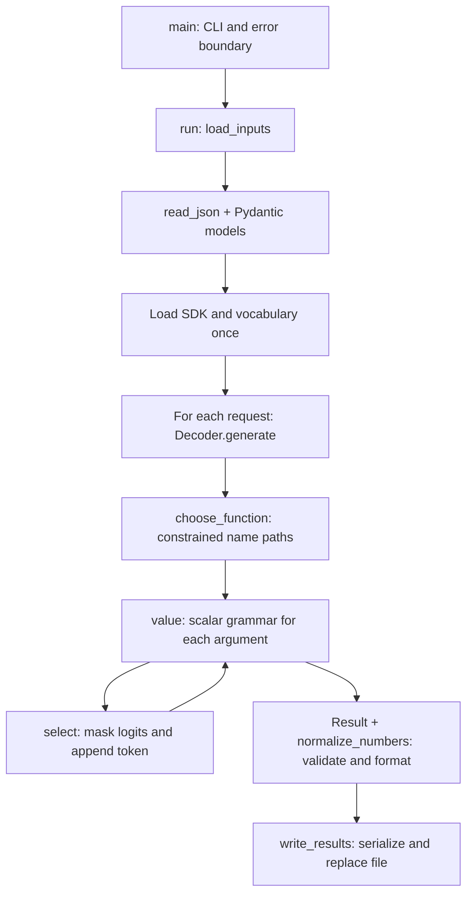

# Developer guide: architecture, functions, and design choices

This describes the **current code**, including its tradeoffs. Start with the
execution flow, then read each module beside its function table. “Why” explains
the choice made here; it does not mean the alternatives cannot work.

## 1. Architecture and ownership

The program **describes a call**; it never executes the requested function.
The LLM chooses the name and argument content. Python supplies the fixed JSON
structure. A grammar limits token choices; Pydantic and explicit checks validate
the completed data.

```text
Call_me/
├── src/
│   ├── __init__.py       Package marker and description; no runtime logic
│   ├── __main__.py       CLI, orchestration, errors, output file
│   ├── schema.py         Input/output models and validation
│   ├── grammar.py        Legal next-byte transitions for scalar JSON
│   └── decoder.py        SDK calls, token masks, function/argument generation
├── llm_sdk/              Supplied model wrapper; application does not modify it
├── data/input/           Function definitions and natural-language requests
├── data/output/          Generated results and supplied reference; Git-ignored
├── tests/                Local verification scripts/fixtures; Git-ignored
├── moulinette/           Separate supplied exercise/grading project
├── pyproject.toml        Dependencies, local SDK source, tool configuration
├── uv.lock               Resolved dependencies for reproducible installation
├── .python-version       Selects Python 3.12; source targets Python 3.10+
├── Makefile              install/run/debug/clean/lint/lint-strict
├── .flake8, .gitignore   Lint scope and generated-file exclusions
└── README.md             Usage, requirements, and recorded benchmark results
```



Imports follow `__main__ → decoder → grammar → schema`, with additional direct
imports of `schema`. Heavy SDK imports occur inside `run()` only after valid,
nonempty input. The decoder is reused across requests, but each request gets a
fresh context. Its vocabulary and token counter persist; model answers do not.

## 2. Data contracts — `src/schema.py`

All application classes inherit `BaseModel`, as required by the subject.
`ConfigDict(strict=True, extra="forbid")` rejects unwanted coercion and extra
fields. Validation applies at construction/explicit validation; it does **not**
automatically validate every method argument or subsequent assignment.

| Model/type | Meaning and reason |
| --- | --- |
| `Scalar` | Python union of `str`, `int`, `float`, `bool`, and `None`: possible argument values. |
| `ScalarType` | Literal JSON type names: restricts which argument grammars can be requested. |
| `Parameter` | One required argument's type and optional description. Description defaults to `""`; the argument itself is not optional. |
| `ReturnType` | Return-type metadata for the model. Also accepts array/object because no return value is generated or executed. |
| `FunctionDefinition` | Nonempty name, description, parameter map, and return metadata. `Annotated[str, Field(min_length=1)]` attaches validation to the name's type. |
| `Request` | Exactly one string `prompt`; an empty string is allowed. |
| `Result` | Exactly `prompt`, `name`, and `parameters`. Its broad scalar union alone cannot enforce the chosen function's individual parameter types. |

| Function | How it works and why it exists |
| --- | --- |
| `reject_constant(value)` | Raises `ValueError` for `NaN`/`Infinity` spellings passed by `json.load`. Python's default JSON parser accepts these nonstandard constants. |
| `unique_object(pairs)` | Builds a dictionary while rejecting duplicate keys. Once an ordinary parser overwrites a duplicate, model validation cannot recover that evidence. |
| `read_json(path)` | Opens UTF-8 text with a context manager and installs both parsing hooks. Adds the filename to file/JSON errors; returns `object` because validation has not established its shape yet. |
| `load_inputs(definitions_path, requests_path)` | Uses `TypeAdapter` to validate both top-level lists, rejects no functions and duplicate function names, and returns typed model lists. An empty request list remains valid. |
| `validate_result(result, function)` | Enforces the selected name, exact argument-key set, each declared type, and finite floats. Dictionary-key equality ignores order, which is correct for JSON objects. |
| `normalize_numbers(result, function)` | Calls `validate_result`, copies the arguments, and converts only declared `number` values to floats. Rejects overflow or precision loss. Returns a new `Result`, preserving the original and all other parameter types. |

`type(value) is int` is intentional: `isinstance(True, int)` is true in Python,
but a JSON boolean must not pass as an integer. Validation accepts integers and
floats for `number`; normalization then gives them a consistent float output
representation (`16.0`). `integer` remains an integer. `math.isfinite` rejects
numeric overflow such as a parsed `1e999`.

This formatting step is necessary because the moulinette checks Python float
types, not just JSON numeric values. Global `parse_int=float` would also convert
declared integers, and a prompt asking for decimals would not guarantee the
format. A schema-aware Pydantic validator could perform this conversion too;
the explicit helper keeps the selected definition visible and verifies that
large integers are not silently rounded by `float()`.

**Why not make every check a Pydantic validator?** `@model_validator` with
validation context or `create_model()` could enforce the dynamic parameter
schema. This implementation passes the selected definition explicitly to one
small function instead of generating classes or threading hidden context.
Pydantic already supports those alternatives; the manual check is a simplicity
choice, not a library limitation. [Pydantic validators](https://docs.pydantic.dev/latest/concepts/validators/)

## 3. Prefix grammar — `src/grammar.py`

`ScalarGrammar(kind, delimiter)` is a frozen Pydantic model containing only
configuration. Progress is a separate state string. Consequently, testing a
candidate token cannot mutate the live generation state.

| Function | How it works and why it exists |
| --- | --- |
| `ScalarGrammar.advance(state, token)` | Runs `step` for **every byte** in a token. Returns its resulting state, or `None` if any byte is illegal. One token can contain several characters or cross multiple states. |
| `ScalarGrammar.step(state, byte)` | Dispatches between beginning/end, number, string, and literal states. Accepts JSON whitespace at the relevant boundaries; requires the specified comma or closing brace to finish. `done` rejects further bytes. |
| `number_step(state, char, kind, delimiter)` | Tracks sign, zero/integer digits, decimal point/fraction, and exponent/sign/digits. Only complete numeric states can terminate. `integer` disallows decimal/exponent syntax. |
| `string_step(state, byte)` | Tracks text, escapes, four hexadecimal digits after `\u`, and raw UTF-8 continuations. Rejects raw control characters and invalid UTF-8 byte sequences. |

Example, with `kind="number"`, delimiter `}`:

```text
start -- '-' --> sign -- '1' --> digits -- '2' --> digits
      -- '.' --> dot -- '5' --> fraction -- '}' --> done
```

Here the second line continues from `digits`. A token containing `12.5}` can
traverse several transitions at once. `01}` is rejected after `0`; `1e}` fails
because an exponent needs a digit. `1e` by itself is a valid *unfinished prefix*.

String state `utf:2:128:191` means “two continuation bytes remain, and the next
must be between 128 and 191.” Bounds distinguish valid UTF-8 from overlong
encodings, encoded surrogate code points, and values above U+10FFFF.
Escaped `\uXXXX` is checked for hexadecimal syntax; this code does not impose
an additional pairing rule on escaped UTF-16 surrogates.

**Why not `json.loads()` or Pydantic at every token?** An unfinished prefix such
as `{"x": -` is not a complete document, yet it is a useful generation state.
Pydantic does have partial parsing/validation, but that facility does not itself
produce the complete legal-next-token mask. This explicit grammar does.
[Pydantic partial validation](https://docs.pydantic.dev/2.10/concepts/experimental/)

The grammar guarantees syntactic prefixes and scalar shapes, not correct
interpretation of the request. Numeric overflow is checked **after parsing**;
therefore a syntactically valid generated number can still fail final validation.

## 4. Model interaction — `src/decoder.py`

`Decoder` owns the SDK object, vocabulary, visualization flag, and cumulative
`generated_tokens` counter. `sdk: Any` accommodates the supplied untyped SDK;
Pydantic does not verify that object's interface. `Field(exclude=True,
repr=False)` keeps it out of model serialization and representations. The
vocabulary is hidden from the representation to avoid a huge debug dump.

| Function | How it works and why it exists |
| --- | --- |
| `vocabulary_bytes(path)` | Reads token-string → ID mappings and reverses the GPT-style printable representation into ID → raw bytes. Preserves partial UTF-8 tokens; skips empty/special-token spellings and rejects unsupported mappings. |
| `Decoder.encode(text)` | Calls public SDK `encode`, converts its tensor using public `.tolist()`, validates `list[list[int]]`, requires one row, and returns that row. This avoids importing Torch merely to handle its return object. |
| `Decoder.select(context, allowed, label)` | Gets next-token logits, checks vector shape, initializes every score to `-inf`, restores permitted scores, excludes non-finite values, and chooses `argmax`. Appends the ID to the same context list, increments the counter, and optionally prints the token. |
| `Decoder.choose_function(context, functions)` | Encodes each JSON-quoted name. At each position, allows the next IDs from remaining candidate paths, lets the LLM select one, and filters paths accordingly. Returns the function whose complete name was selected. |
| `Decoder.value(context, grammar, label)` | Tests every vocabulary entry against the current grammar state, records valid ID → next-state transitions, calls `select`, appends selected bytes, and repeats until `done`. Returns a complete scalar **including its delimiter**. |
| `Decoder.generate(prompt, functions)` | Builds the model prompt; chooses a name; inserts required keys; generates one typed value per key; parses the argument bytes; builds `Result` and returns `normalize_numbers(...)`. With zero arguments it supplies `{}` directly. |

The vocabulary's visible-byte ranges `33–126`, `161–172`, and `174–255` come
from its byte encoding; remaining bytes map to characters starting at code point
256. These are format constants, not model guesses. This reverses a vocabulary
representation; it does not recreate BPE tokenization or its merge algorithm.
[Byte representation reference](https://github.com/openai/gpt-2/blob/master/src/encoder.py)

Name selection is a small trie represented by candidate lists. It constrains
**canonical encoded name sequences**, not all possible tokenizations of those
names. Selection is greedy at each token, not a comparison of complete-name
probabilities. Even a one-choice step currently calls the SDK.

Important instructions inside generation:

| Expression/choice | Why this exact operation; alternative/tradeoff |
| --- | --- |
| `np.full(..., -np.inf)` | An illegal token must never beat a legal score. Zero is unsafe because legal logits may be negative. |
| `np.argmax(masked)` | Deterministic highest-scoring legal token. No softmax is needed because it preserves ordering; sampling would introduce variation. Ties choose the first maximum. [NumPy reference](https://numpy.org/doc/2.2/reference/generated/numpy.argmax.html) |
| `float64` / `int64` arrays | Explicit floating score and integer-index types. `float64` is not a subject requirement and does not increase the model's own precision. |
| `context.append(token_id)` | The next SDK call must see the token just selected. Omitting this would repeatedly predict from the old context. |
| `bytearray` accumulation | Efficiently appends bytes while retaining split characters; final decoding happens only when the JSON value is complete. |
| `json.dumps(name) + ":"` | Escapes arbitrary parameter names safely. No trailing space is forced: many model tokens already contain leading whitespace. A prior forced space created an awkward token boundary. |
| `exclude_defaults=True`, compact separators | Removes default empty descriptions and unnecessary prompt whitespace; keeps required definitions while reducing context size. |
| `ensure_ascii=True` | Makes fixed JSON keys ASCII-encodable even for Unicode names. Escaping preserves their actual JSON string values. |
| `cast(dict[str, Any], ...)` | Gives mypy a type for `json.loads` output. **No runtime checking occurs in `cast`**; `Result` and `validate_result` perform that checking. |

### Why each natural-language instruction exists

| Prompt clause | Intended effect |
| --- | --- |
| Select the function fulfilling the request | Gives the model the semantic selection task; Python only limits available names. |
| Extract arguments; do not execute/compute | Requests `a=2, b=3`, rather than the answer `5`. |
| Copy spelling/case; do not add surrounding spaces | Reduces unwanted normalization and padded string arguments; it does not authorize trimming spaces present in the input. |
| Preserve signs/decimals; remove numeric leading zeros | Reduces lost minus signs and prevents zero-padded input from being written as invalid JSON numeric notation. |
| Return `name` and `parameters` | Aligns the model's expected answer with the forced structure. The original `prompt` is copied by Python instead of regenerated. |
| Include all available definitions | Allows changed function sets without keyword dispatch rules or stored answers. |

ChatML role markers and `<think>\n\n</think>\n\n` match Qwen's non-thinking
assistant prefix. They are model-format details, not general JSON syntax.
The SDK exposes no chat-template method among the allowed calls, so the prefix
is built explicitly. The wording was adjusted after observed errors; it is
**tested wording, not proven optimal wording**. The grammar—not the instruction
“return JSON”—enforces structure. [Qwen model documentation](https://huggingface.co/Qwen/Qwen3-0.6B)

## 5. Entry point and output — `src/__main__.py`

| Function | How it works and why it exists |
| --- | --- |
| `parse_arguments()` | Uses `argparse` for the three subject file options and `--visualize`; converts paths to `Path` objects and supplies required defaults/help. |
| `run(arguments)` | Rejects an output path resolving to an input path, validates inputs, loads the SDK/vocabulary once, processes requests in order, and writes the batch. Adds the failing prompt's index to generation errors. Empty batches skip model loading. |
| `write_results(path, results)` | Converts models to dictionaries, serializes the entire list with `allow_nan=False`, creates the output directory, writes a temporary file there, closes it, and calls `os.replace`. `finally` removes any leftover temporary file. |
| `main()` | Converts operational exceptions to readable stderr messages/status 1, Ctrl-C to 130, and success to 0. `sys.exit(main())` exposes that status to the shell. Argparse handles usage errors with status 2. |

Writing a sibling temporary file lets `os.replace` publish the completed file
on the same filesystem. Opening the destination directly could truncate the
previous result before writing succeeds. This is atomic publication, not a
power-loss durability guarantee: the code does not call `fsync`.

Broad `except Exception` is used at the application boundary and to annotate a
prompt failure. It reports failure and stops; it does not invent fallback calls.
Context managers close files. `time.perf_counter()` measures elapsed duration;
`sys.stderr` separates progress/errors from the result file.

## 6. Libraries versus Pydantic alternatives

Pydantic is a validation/serialization tool, not a replacement for every part
of Python. The project uses it where the data contract is known.

| Tool | Why used here; Pydantic equivalent or alternative |
| --- | --- |
| `BaseModel`, `ConfigDict`, `Field`, `Annotated`, `Literal` | Describe validated objects and constraints. Plain dictionaries/dataclasses would need additional validation and would not meet the subject's class requirement. |
| `TypeAdapter` | Validates existing list/dict types without adding wrapper classes. `RootModel` could wrap those collections but provides no needed behavior here. |
| `json.load` + hooks | Detects duplicate keys and forbidden constants before typed validation. `model_validate_json`/`TypeAdapter.validate_json` are legitimate direct-parsing alternatives; this path retains explicit parser-hook control. |
| `model_dump` + `json.dumps` | Serializes the complete result list with an explicit `allow_nan=False` guard. `TypeAdapter(list[Result]).dump_json` could serialize it, but validation of dynamic types/finiteness must still be supplied. |
| `math.isfinite` | Checks a single parsed float. Pydantic `FiniteFloat`, `allow_inf_nan=False`, or a validator could enforce finiteness; here the check is grouped with the dynamic per-function type rules. |
| NumPy | Masks and selects across a large numeric logit vector. Python lists/`max` could work; NumPy makes the vector operations explicit. Pydantic can validate data but has no equivalent inference-selection operation. |
| `argparse` | CLI parsing/help without another dependency. A Pydantic settings/CLI integration is possible but unnecessary for four options. |
| `pathlib`, `tempfile`, `os` | Filesystem paths, temporary files, and replacement. Pydantic path types can validate a path's properties; they do not perform these I/O operations. |
| `typing.Any`, unions, `cast` | Describe interfaces for static checking. Type hints alone are not runtime validation; `Any` intentionally leaves the SDK boundary weakly typed. |
| `llm_sdk` | Required model-access boundary. Its Torch, Transformers, and Hugging Face dependencies run internally; application modules never import them directly. Pydantic cannot perform model inference. |
| flake8 / mypy / uv | Style checks / static typing / environment and lockfile management. They solve different problems from Pydantic's runtime validation. |

Strict mode is important because a convenient conversion such as `"123" → 123`
would hide an extraction error. It does not establish semantic correctness.
[Pydantic strict-mode documentation](https://docs.pydantic.dev/latest/concepts/strict_mode/)

Configuration keeps NumPy below 2.3 for the Python 3.10 typing target, and
constrains the SDK's Transformers dependency to `>=4.51,<5` for Qwen support
within the tested major version. Root `uv sync` installs the local SDK and
development tools; the separate moulinette has its own dependencies and lock.

## 7. Supplied SDK: public method map

| Method | Responsibility and application use |
| --- | --- |
| `Small_LLM_Model.__init__()` | Loads Qwen/tokenizer and chooses device/precision. Application uses the default model and `trust_remote_code=False`; it needs no remotely supplied custom Python implementation. |
| `encode(text)` | Tokenizes without adding special tokens; returns one tensor row. Called through `Decoder.encode`. |
| `decode(ids)` | Converts IDs to readable text, skipping special tokens. Used only for visualization; an isolated partial Unicode token may display imperfectly. |
| `get_logits_from_input_ids(ids)` | Runs a forward pass on the supplied context and returns final-position scores. Called by `select`. No persistent KV cache is exposed or used by the application. |
| `get_path_to_vocab_file()` | Obtains the vocabulary path used by `vocabulary_bytes`. |
| `get_path_to_merges_file()` / `get_path_to_tokenizer_file()` | Supplied helpers for other tokenizer resources; **neither is called by the application**. |

## 8. Local tests and the separate moulinette

In `tests/checks.py`, `must_fail(action)` asserts an expected validation/I/O
failure. `test_scalar_grammar()` covers accepted/rejected values, byte splits,
UTF-8, and randomized string encodings. `test_schema_and_files()` checks models,
strict numeric types, file parsing, and preserved output. `test_logit_mask()`
uses a fake SDK to prove invalid scores cannot win. `test_cli_errors()` launches
real subprocesses to check statuses and output preservation.
`test_source_boundaries()` inspects Python ASTs for forbidden imports/SDK access
and Pydantic class inheritance. These tests are local, not application features.
Their `ast`, `random`, `subprocess`, and `SimpleNamespace` imports support source
inspection, generated cases, CLI execution, and mocking—not data validation.

`tests/number_format_checks.py` adds `generate_from_tokens(...)`, which feeds
controlled SDK token scores through the real decoder. Its `main()` verifies
both square-root cases, addition, mixed parameter types, on-disk JSON types,
and rejection of unsafe conversions. Its nested `logits(context)` supplies
the next planned character's score. These tests do not need model weights.

The `moulinette/` directory is a separate project, not imported by `src`:

| File / functions | Role |
| --- | --- |
| `__main__.py`: `Moulinette.__init__`, `prepare_exercises`, `grade_student_answers` | Creates a formatter; generates input/correction files; grades calls by executing fixture functions and comparing results. Preparation deletes/recreates its selected input/correction directories. |
| `extract_functions_infos.py`: `extract_function_info`, `generate_function_calling_definition` | Inspects Python function names, docstrings, annotations, and argument names into `ParameterInfo`/`FunctionInfo` models, then writes JSON definitions. |
| `generate_tests_and_corrections.py`: `generate_function_calling_corrections`, `save_function_calling_corrections`, `save_function_calling_tests` | Executes expected fixture calls to make `Correction` models; saves full corrections or prompt-only input. |
| `functions_definition.py`: `get_exercises_by_visibility`, `get_functions_by_visibility` | Filters the exercise registry and returns its callable keys. Visibility is a fixture label, unrelated to SDK private attributes. |
| Public fixtures: `fn_add_numbers`, `fn_greet`, `fn_reverse_string`, `fn_get_square_root`, `fn_substitute_string_with_regex` | Add values; format a greeting; slice a string backwards; call `math.sqrt`; apply `re.sub`. |
| Other fixtures: `fn_multiply_numbers`, `fn_is_even`, `fn_calculate_compound_interest` | Multiply; test modulo two; calculate `principal * (1 + rate) ** years`. |
| Other fixtures: `fn_execute_sql_query`, `fn_read_file`, `fn_format_template` | Return formatted descriptive strings. They do not execute SQL, read the named file, or substitute template placeholders. |
| `output_formatter.py`: `_supports_color`, `ColoredOutput.__init__`, `_color` | Detects color support, stores it, and conditionally wraps text in terminal color codes. These belong to the supplied formatter, not the SDK. |
| Formatter: `separator`, `success`, `error`, `warning`, `info` | Prints a dividing line or appropriately labeled/colored status message. |
| Formatter: `expected`, `actual`, `prompt`, `test_header`, `test_result`, `summary` | Prints comparison values, request text, numbered heading, pass/fail result, and final score/percentage. |

Its `fire` dependency exposes class methods as CLI commands; `colorama` supplies
terminal colors. Pydantic has no equivalent color-rendering role, and the
existing grader uses Fire for command dispatch. `shutil` handles directory
cleanup, while `typing.get_type_hints` inspects fixture annotations. These were
choices in the supplied utility, not additional application dependencies.

## 9. Limits and current-state details worth knowing

- The 8192-context-token and 256-generated-token-per-value limits are defensive
  implementation limits, not Qwen's advertised capacity. An unfinished value
  causes failure; it is not truncated into fabricated valid JSON.
- Argument generation scans the vocabulary on every step. With vocabulary size
  `V`, average token-byte length `L`, and `T` generated value tokens, grammar
  work is roughly `O(T × V × L)`, in addition to model inference. No transition
  or answer cache is implemented; earlier measured batches met the time target.
- Name/key/punctuation structure is fixed where the schema determines it.
  Generated values stop at their argument delimiters. The application does not
  wait for model EOS or generate a full outer response: final JSON serialization
  supplies that outer document and the copied prompt.
- Current `run()` prints `elapsed/60` with an `s` suffix: **minutes are labeled
  as seconds**. Use `elapsed` with `s`, or retain `/60` and label minutes. This
  guide records the discrepancy; it does not change the implementation.
- The moulinette asserts Python `float` for several `number` arguments.
  `normalize_numbers` handles this boundary after strict validation. Converting
  an integer too large to represent exactly as a finite float fails clearly,
  rather than silently producing a different argument value.
- Root lint exclusions cover SDK/tests/virtual environments, but do not exclude
  the separate moulinette directory. Its presence changes the scan scope from
  the earlier recorded application-only checks.
- Valid schema is not guaranteed correct intent. Ambiguous requests still
  produce a chosen call. A generation/I/O error yields an error status rather
  than a new output file; the existing result file is preserved on batch failure
  before replacement.

For navigation, read `generate()` first, then `value() → advance() → step()`,
and finally `select()`. That is the core constrained-decoding loop; the remaining
modules establish and protect its input/output contracts.
